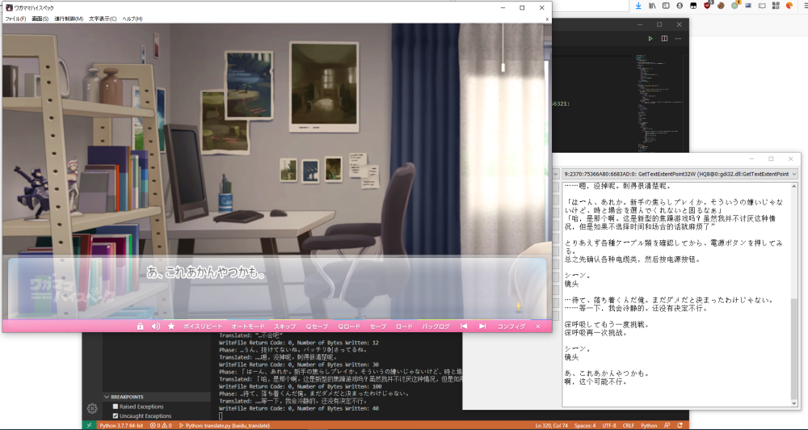

# Textractor - Baidu Fanyi/Translation Edition

Added Baidu Fanyi extension. Note that the extension uses Windows named pipe to communicate with [another application](https://github.com/moonlightelite/BaiduTranslator) that does the communication with Baidu Fanyi.

Textractor should be run with [Locale Emulator](https://pooi.moe/Locale-Emulator/) set to Chinese(Simplified), while the target application should be run with the Japanese Locale.

The translation script BaiduTranslator should be run before Textractor to ensure the named pipe is setup. Run the script in daemon mode -d and wait until the script says 'Waiting for Client to connect.'

If you change the extension To Language setting to something other than eng, when Textractor starts up, you might get an assertion error. Just press ignore. It's not going to affect the app.

Try to make sure you are hooking the correct thread. Baidu Fanyi doesn't like it when you try to spam the servers with thousands of phrases in a short period of time...

##
Original Textractor README page

[English](README.md) ● [Español](README_ES.md) ● [简体中文](README_SC.md) ● [Русский](README_RU.md) ● [한국어](README_KR.md) ● [ภาษาไทย](README_TH.md) ● [Italiano](README_IT.md) ● [日本語](README_JP.md) ● [Bahasa](README_ID.md) ● [Português](README_PT.md)

**Textractor** (a.k.a. NextHooker) is an open-source x86/x64 video game text hooker for Windows/Wine based off of [ITHVNR](http://www.hongfire.com/forum/showthread.php/438331-ITHVNR-ITH-with-the-VNR-engine). 
Watch the [tutorial video](https://tinyurl.com/textractor-tutorial) for a quick rundown on using it.

## Download

Releases of Textractor can be found [here](https://github.com/Artikash/Textractor/releases). 
The last release of ITHVNR can be found [here](https://drive.google.com/open?id=13aHF4uIXWn-3YML_k2YCDWhtGgn5-tnO). 
Try running vcredist if you get an error when starting Textractor.

## Features

- Highly extensible and customizable
- Auto hook many game engines (including some not supported by VNR!)
- Hook text using /H "hook" codes (most AGTH codes supported)
- Directly extract text using /R "read" codes

## Support

Please let me know of any bugs, games that Textractor has trouble hooking, feature requests, or other suggestions. 
If you have trouble hooking a game please email me a place where I can freely download it, or gift it to me on [Steam](https://steamcommunity.com/profiles/76561198097566313/).

## Extensions

See my [Example Extension project](https://github.com/Artikash/ExampleExtension) to see how to build an extension. 
See the extensions folder for examples of what extensions can do. 

## Contributing

All contributions are appreciated! Please email (no, I'm not busy!) me at akashmozumdar@gmail.com if you have any questions about the codebase. 
You should use the standard process of making a pull request (fork, branch, commit changes, make PR from your branch to my master). 
Contributing a translation is easy: just translate the strings in text.cpp as well as this README.

## Compiling

Before compiling *Textractor*, you should get Visual Studio with CMake support, as well as Qt version 5.13 
You should then be able to simply open the folder in Visual Studio, and build. Run Textractor.exe.

## Project Architecture

The host (see GUI/host folder) injects texthook.dll (created from the texthook folder) into the target process and connects to it via 2 pipe files. 
Host writes to hostPipe, texthook writes to hookPipe. 
texthook waits for the pipe to be connected, then injects a few instructions into any text outputting functions (e.g. TextOut, GetGlyphOutline) that cause their input to be sent through the pipe. 
Additional information about hooks is exchanged via shared memory. 
The text that the host receives through the pipe is then processed a little before being dispatched back to the GUI. 
Finally, the GUI dispatches the text to extensions before displaying it.

## [Developers](CREDITS.md)
